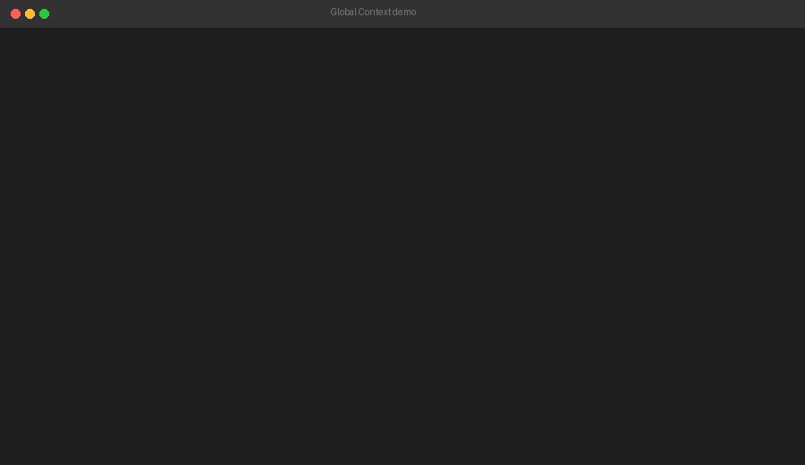

# Global Context

Share context across terminal AI coding assistants: **Claude Code**, **Kimi Code CLI**, **OpenAI Codex CLI**, and any future terminal-based AI that reads files from your project.

When you switch from one AI to another, you lose the conversation thread. Global Context solves this by keeping a single Markdown file in each project that every AI can read and update.



---

## Supported AI assistants

| AI | Integration type | Auto-load |
|---|---|---|
| Claude Code | Hooks in `~/.claude/settings.json` | ✅ Yes |
| Kimi Code CLI | Skill (system prompt) | ✅ Yes |
| OpenAI Codex CLI | Skill + prompt template | ✅ Yes |
| Google Gemini CLI | Skill (system prompt) | ✅ Yes |
| Other terminal AIs | Read `.globalcontext.md` | ⚠️ Manual start |

---

## Installation

### macOS / Linux / Git Bash on Windows

```bash
curl -fsSL https://raw.githubusercontent.com/VortexJer/Global-Context/main/install.sh | bash
```

Install for all detected AIs without prompting:

```bash
curl -fsSL https://raw.githubusercontent.com/VortexJer/Global-Context/main/install.sh | bash -s -- --ai all
```

### Windows (PowerShell)

```powershell
irm https://raw.githubusercontent.com/VortexJer/Global-Context/main/install.ps1 | iex
```

Install for all AIs:

```powershell
irm https://raw.githubusercontent.com/VortexJer/Global-Context/main/install.ps1 | iex; install-globalcontext -Ai all
```

### Local install (for development)

```bash
git clone https://github.com/VortexJer/Global-Context.git
cd globalcontext
./install.sh --local
```

### Uninstall

Removes everything the installer added — PATH entry, the shell/PowerShell
function, the Claude hooks in `settings.json`, the Kimi/Codex/Gemini skills,
and the install directory. Your other `settings.json` keys are preserved.

```bash
# macOS / Linux / Git Bash
./install.sh --uninstall
```

```powershell
# Windows PowerShell (the installer is copied into the install dir)
& "$env:USERPROFILE\.globalcontext\install.ps1" -Uninstall
```

To remove only the AI integrations (and keep the CLI on PATH):

```bash
globalcontext uninstall --ai all
```

---

## Quick start

1. **Install** Global Context for the AIs you use.
2. Register a project (optional but recommended):

   ```bash
   globalcontext register mi-web "~/projects/mi-web"
   ```

3. Open Claude, Kimi, or Codex anywhere and say:

   > "Open project mi-web"

   The AI will run `globalcontext resolve mi-web`, find the project's `.globalcontext.md`, and load it.

4. You can also start a brand-new project without a path:

   > "Let's build a calculator"

   The AI will run:

   ```bash
   globalcontext new calculator
   ```

   This creates `~/GlobalContext-Projects/calculator--<path-suffix>/.globalcontext.md` automatically. The folder suffix is derived from the project path to avoid collisions.

5. When you finish a task, the AI appends a summary to the resolved `.globalcontext.md`.
6. Switch AI tools and continue — the context is already there.

You can also use `.globalcontext.md` in the current directory without registering anything.

---

## CLI commands

```bash
globalcontext init                  # Create .globalcontext.md in current folder
globalcontext status                # Show active context file
globalcontext status --show         # Show active context contents
globalcontext append notes.md --label Kimi   # Append a file to the context

globalcontext new <name>               # Create a project under ~/GlobalContext-Projects/
globalcontext new <name> --dir <path>  # Create a project at a custom path

globalcontext register <name> <path>   # Name a project directory
globalcontext unregister <name>        # Remove a registered name
globalcontext list                     # List registered projects
globalcontext resolve <name-or-path>   # Get/create the context file for a project

globalcontext install               # Install AI integrations (interactive)
globalcontext install --ai all      # Install all integrations
globalcontext doctor                # Check installation status

# Checkpoint / recover (reliable context updates)
globalcontext checkpoint            # Mark a pending update before an AI response
globalcontext checkpoint-complete   # Append summary and clear the pending marker
globalcontext recover               # Consolidate stale pending checkpoints
globalcontext recover --dry-run     # Preview what would be recovered

globalcontext --version             # Show version
```

---

## How it works

Global Context does **not** try to corrupt or rewrite internal AI session files. Instead it uses the one thing every AI can do: **read and write Markdown files on disk**.

- Each project gets a `.globalcontext.md` file inside its own directory.
- Projects can be registered with a friendly name (`globalcontext register <name> <path>`).
- Claude Code loads the local context automatically via cross-platform hooks written to `~/.claude/settings.json` (`SessionStart` + a `checkpoint`/`Stop` marker lifecycle) and can resolve named projects on request. These hooks stay inert in projects that do not have a `.globalcontext.md`.
- Kimi Code CLI loads the local context via a skill and can resolve named projects by running `globalcontext resolve <name>`.
- Codex loads the local context via a skill and can resolve named projects the same way.
- Gemini CLI loads the local context via a skill and can resolve named projects the same way.
- Every AI prefixes its summaries with its name (`Claude:`, `Kimi:`, `Codex:`) so you know who did what.

This means you can open your AI in any directory and say *"open project mi-web"* instead of `cd`-ing into the project folder.

---

## Context file format

`.globalcontext.md` is plain Markdown:

```markdown
# Global Context

Shared context for terminal AI assistants.

- **Project:** `/home/user/my-project`
- **Created:** 2026-07-10 12:00:00 UTC

## Rules

- Prefix important session summaries with the AI name.
- Keep entries concise but informative.
- Do not delete old entries unless requested.

---

## Claude — 2026-07-10 12:30 UTC

- Set up the project structure.
- Pending: implement the API endpoint.

---

## Kimi — 2026-07-10 13:00 UTC

- Implemented the API endpoint.
- Added basic tests.

---
```

---

## Reliability & recovery

Global Context now uses a **checkpoint/recover** mechanism so updates are not lost if a session is interrupted.

| AI | Marker lifecycle | Pending flag + recovery |
|---|---|---|
| Claude Code | ✅ Automated via hooks — a `.globalcontext.pending` marker is created before each response and cleared on `Stop`. | ✅ Automatic on next `SessionStart` |
| Kimi Code CLI | ⚠️ No native hook — the skill instructs the model to checkpoint before/after each response. | ✅ Automatic on next session start |
| OpenAI Codex CLI | ⚠️ No native hook — the skill instructs the model to checkpoint before/after each response. | ✅ Automatic on next session start |
| Google Gemini CLI | ⚠️ No native hook — the skill instructs the model to checkpoint before/after each response. | ✅ Automatic on next session start |

> **Note:** No AI writes the summary entry from a hook. The `.globalcontext.md` entry itself is always written by the model following the skill/plugin instructions. Hooks only manage the pending marker so an interrupted turn can be detected and recovered.

How it works:

1. Before an assistant response, a `.globalcontext.pending` marker is written next to `.globalcontext.md`.
2. When the response finishes and the summary is written, the marker is deleted.
3. If the response is cut off (crash, Ctrl+C, network error, credit limit, power loss), the marker stays on disk.
4. On the next session start, `globalcontext recover` checks for stale markers and appends a `Recovery` entry so the next AI knows the previous turn was interrupted.

The marker is a plain file, so it survives reboots and does not depend on any running process.

---

## Limitations

- **No native session sync**: Global Context cannot make a Claude session appear inside Kimi or vice versa. It keeps a shared Markdown journal instead.
- **Skill-based checkpointing**: Kimi, Codex and Gemini rely on the model following the checkpoint instructions. Claude Code additionally has native hooks that enforce the marker lifecycle.
- **Large contexts**: If the file grows too large, add a `## Compacted Summary` section and archive old details. See [FORMAT.md](FORMAT.md) for the full spec.

---

## Contributing

Pull requests are welcome. The project is intentionally simple: a CLI, a Markdown convention, and small integrations for each AI tool.

## License

MIT
